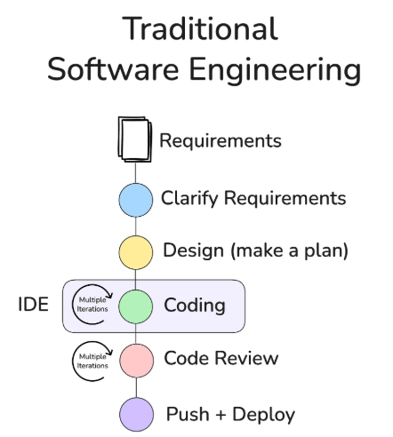
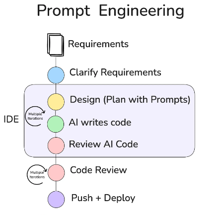
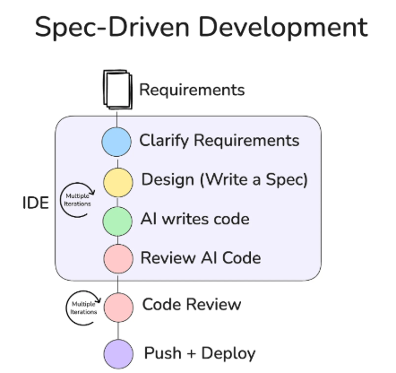
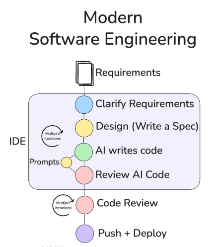
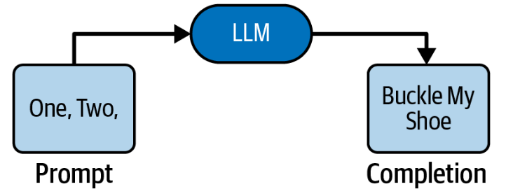
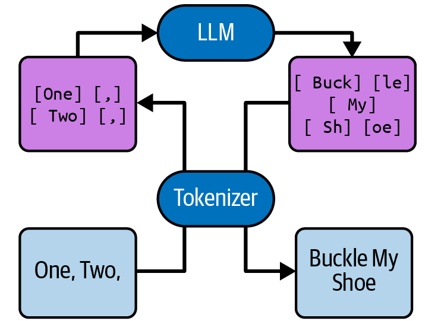
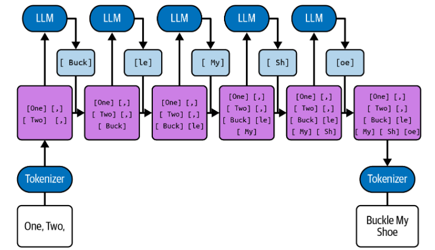
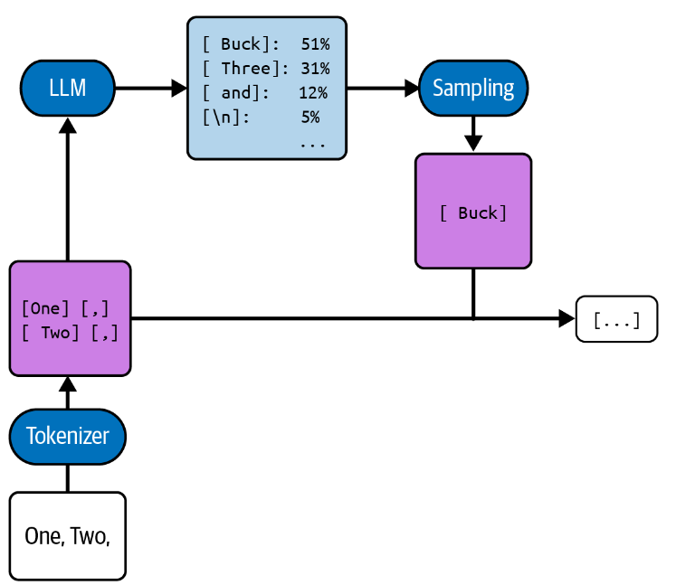

# Agenda

1. Introduction
2. Generative AI
   1. What is Generative AI?
   2. Software Engineering Models for Generative AI
   3. Traditional Software Engineering
   4. Prompt Engineering
   5. Spec-Driven Development
   6. Modern Software Engineering
3. Where is the "agnostic" in Generative AI?
4. Introduction to Prompt Engineering
5. Understanding LLM?
6. Moving to Chat
7. Donald Knuth doing AI
8. The Five Principles of Prompting
   1. Give Direction
   2. Specific Format
   3. Provides Examples
   4. Evaluate Quality
   5. Divide Labor
9. Web Development
   1. Web
   2. Rest API
   3. Microservices
   4. Serverless
10. Web Development - Prompting
    1. Give Direction
    2. Specific Format
    3. Provides Examples
    4. Evaluate Quality
    5. Divide Labor
11. Conclusions
12. References

# Development

## 1. Introduction

---

## 2. Generative AI

### What is Generative AI?

> "Generative AI ... is about creating something new that is not modified or copied from its training data. Whereas traditional AI makes predictions based on input data, generative models create new things by predicting the next set of words based on their ability to generate and understand the semantics of the real world."[^fn1]

> "Generative AI can be thought of as a machine-learning model that is trained to create new data, rather than making a prediction about a specific dataset. A generative AI system is one that learns to generate more objects that look like the data it was trained on."[^fn2]

---

### Software Engineering Models for Generative AI

Soto specifies different Software Engineering Models[^fn2]

* Traditional Software Engineering
* Prompt Engineering
* Spec-Driven Development
* Modern Software Spec-Driven Development

---

### Traditional Software Engineering

---

### Prompt Engineering

---

### Spec-Driven Development

---

### Modern Software Engineering

---

## 3. Where is the "agnostic" in Generative AI?

### What is Agnostic? 

> "Agnostic, in an [information technology](https://www.techtarget.com/searchdatacenter/definition/IT) (IT) context, refers to something that is generalized so that it is [interoperable](https://www.techtarget.com/searchapparchitecture/definition/interoperability) among various systems. The term can refer to [software](https://www.techtarget.com/searchapparchitecture/definition/software) and [hardware](https://www.techtarget.com/searchnetworking/definition/hardware), as well as [business processes](https://www.techtarget.com/searchcio/definition/business-process) or practices."[^fn4]

> "... refers to the interoperability and compatibility capacity of a computing component between various systems and environments, without requiring special adaptation. The term does not refer only to software and hardware but also to processes and tasks."[^fn5]

---

### Where is agnostic in Generative AI?

> "Principles of Prompting [Engineering] ... These principles are model-agnostic and should work to improve your prompt no matter which generative text or image model you’re using. "[^fn6]

---

## 4. Introduction to Prompt Engineering

### Prompt Engineering Definition

* The input into the model is called the *prompt*—it is a document, or block of text, that we expect the model to complete.
* *Prompt Engineering* is the practice of crafting the prompt so that its completion contains the information required to address the problem at hand.
* To build a quality piece of software and a quality UX, the prompt engineer must create a pattern for iterative communication among the user, the application, and the LLM.
* The science *and art* of prompt engineering is to make sure that this communication is structured in a way that best translates among very different domains, the user’s problem space, and the document space of LLMs.

---

### Levels of Sophistication's Prompt Engineering

* The most basic form makes use of only a very thin application layer (*ChatML*).
* The interactions with the LLM become *stateful*, meaning they maintain context and information from prior interactions.
* Next layer involves giving the LLM-based application tools that allow the LLM to reach out into the real world by making API requests to read information or to even create or modify assets that are available on the internet.
* To provide the LLM application with agency—the ability to make its own decisions about how to accomplish broad goals supplied by the user. 

---

## 5. Understanding LLMs

### Introduction

* LLMs are simply models that predict the next word in a block of text.
* LLMs are merely tools for helping users to accomplish some task.
* The way that you interact with these tools is by crafting the *prompt*―the block of text―that they are to complete (*prompt engineering*).

---

### What is LLM?

* An *LLM* is a service that takes a string and returns a string: text in, text out.
* The input is called the *prompt*, and the output is called the *completion* or sometimes, the *response*:
* Image: [^fn6]

---

### What is LLM? (2)

* [Construcción de modelos lingüisticos de gran tamaño](https://www.youtube.com/watch?v=9vM4p9NN0Ts)
* LLM needs to be trainned before it's useful.
* *Foundation Models*
* *Training set*
* The resulting completion should be the text that is most likely to continue the original document
* ***Models mimic***

---

### What is LLM? (3)

* The LLM selects the most likely looking continuation, and this goes against some assumptions humans make when reading text.
* The model can’t google or edit, so it just guesses.
* LLMs are really good at emulating any patterns they find in the items they guess about.
* The fact that LLMs are trained as “training data mimic machines” has unfortunate consequences: *hallucinations*
* The best antidote to hallucinations is “Trust but verify,” just minus the trust.

---

### How LLMs See the World

* [How many R's in "Strawberry"](https://www.inc.com/kit-eaton/how-many-rs-in-strawberry-this-ai-cant-tell-you.html)
* Image [^fn6]

---

### How LLMs See the World (2)

* LLMs Use Deterministic Tokenizer
* LLMs Can’t Slow Down and Examine Letters
* LLMs See Text Differently

---

### One Token at a Time

*  The LLMs isn’t directly text to text, and it’s not really directly tokens to tokens either.
* Auto-Regressive Models
* Patterns and Repetitions

---

### One Token at a Time (2) - Auto-Regressive Models

* Image: [^fn6]

---

### One Token at a Time (3) - Patterns and Repetitions

* Another issue with autoregressive systems is that they can fall into their own patterns
* LLMs are good at recognizing patterns, so they sometimes (by chance) create a pattern and can’t find a good point to leave it
* *Given the pattern*, at any given token, it’s more likely that it continues than that it breaks
* This leads to very repetitive solutions
* The way to deal with such repetitive solutions is typically to simply detect and filter them out

---

### Temperature and Probabilities

* LLMs computes the probability of *all possible tokens* before choosing a single one
* The process under the hood that chooses the actual token is called *sampling*
* Image: [^fn6]

---

### Temperature and Probabilites (2)

* The temperature is a number of at least zero that determines how “creative” the model should be
* More specifically, if the temperature is greater than 0, the model will give a stochastic completion, where it selects the most likely token with the highest probability but maybe also returns less likely but still not totally absurd tokens
* The higher the temperature and the closer the logprobs of the best tokens are to each other, the more likely it is that the second-best-placed token will be selected, or even the third or fourth or fifth
* High temperatures can make LLMs sound like they’re drunk

---

## 6. Moving to Chat

---

## 7. Donald Knuth doing Generative AI

* [Claude's Cycle](https://www-cs-faculty.stanford.edu/~knuth/papers/claude-cycles.pdf)

---

## 8. The Five Principles of Prompting

### Problems of prompting

* Vague direction
* Unformatted Output
* Missing Examples
* Limited Evaluation
* No Task Division

---

### The Five Principles of Prompting

* Give Direction
* Specific Format
* Provides Examples
* Evaluate Quality
* Divide Labor

---

### Give Direction

> "Describe the desired style in detail, or reference a relevant persona"[^fn6]

* The use of *role-playing*
* Included in the prompt as context to guide the AI toward get the solution (*Prewarning or internal retrieval*)
* Take the best advice out there for the task you want to accomplish and insert that context into the prompt

---

### Specific Format

> "Define what rules to follow, and the required structure of the response"[^fn6]

* AI models are universal translators
* LLMs could return a different format with the same prompt
* When setting a format, it is often necessary to remove other aspects of the prompt that might clash with the specified format
* There is often some overlap between the first and second principles, Give Direction and Specify Format

---

### Provides Examples

> "Insert a diverse set of test cases where the task was done correctly"[^fn6]

* A prompt with no examples *zero-shot*
* Adding one example along with a prompt can improve accuracy in some tasks from 10% to near 50%!

---

### Evaluate Quality

> "Identify errors and rate responses, testing what drives performance"[^fn6]

* *Blind prompting*
* It depends largely on what tasks you’re accomplishing
* Different models perform differently across different types of tasks, and there is no guarantee a prompt that worked previously will translate well to a new model

---

### Evaluate Quality (2) - Points to evaluate

* Cost
* Latency
* Calls
* Performance
* Classification
* Reasoning
* Hallucinations

---

### Divide Labor

> "Split tasks into multiple steps, chained together for complex goals"[^fn6]

* One of the core principles of engineering is to use task decomposition to break problems down into their component parts, so you can more easily solve each individual problem and then reaggregate the results
* Breaking your AI work into multiple calls that are chained together can help you accomplish more complex tasks, as well as provide more visibility into what part of the chain is failing.

---

## 9 Web Development

* Monolithic Architecture
* Micro-services Architecture
* Serverless Execution Model

---

### Monolithic Architecture Model

* Single code base with shared database
* Deployed and scaled as one unit
* Changes require full redeploy 
* Features impact the entire system}

---

### Micro-services Architecture Model

* Independently deployable services
* Each service owns database
* Service scale independently
* Requires distributed observability and service configuration

---

### Serverless Execution Model

* Event triggered functions (HTTP, queue, etc.)
* No server management required
* Stateless compute (external state)
* Cold starts can add latency

---

## 10 Prompt Engineering in Monolithic Architecture

### Give Direction

* Modularization
* Database Separation
* API-Driven Design
* Caching & Asynchronous Processing
* Application Context
* Roles
* User flow

---

### Specific Format

* Programming Language
* Output formats: HTML, CSS, JSON, XML, etc.
* Layout and Visual Structure

---

### Provides Examples

* Specification over Configuration
* Provides expects inputs and outputs
* Where the application will be used 

---

### Evaluate Quality

- Write Tests Before You Prompt
- Property-Based Testing
- Adversarial AI Review
- Human-in-the-Loop Review 

---

### Divide Labor

* Task decomposition is a crucial strategy for you to tap into the full potential of LLMs
* Remember, designing your tasks in a sequential chain greatly benefits from the Divide Labor principle
* Breaking tasks down into smaller, manageable chains can increase the overall quality of your output
* When using tools, make sure you divide the tasks appropriately
* It’s important to choose the right model for the job
* Instead of expecting a nontechnical person to submit a good-quality prompt, simply pass their input to another AI model that can help improve the original prompt

---

## 11 Conclusions

* Prompt Engineering is our agnostic tool
* Follow prompt engineering principles, but apply them with criteria tailored to the specific context of the target application. 
* Direction and Structure Are Essential
* Specify Output Formats and Standards
* Use Examples and Specifications
* Quality Assurance Is Integral
* Divide and Delegate Tasks

---

## 12 References

[^fn1]: [@bajree:2024]
[^fn2]: [@mit-news:2023]
[^fn3]: [@soto:prompt-engineering:2026]

[^fn4]: [@techtarget:2022]
[^fn5]: [@medium-wiitbaisd:2021]
[^fn6]: [@phoenix:taylor:2024]
[^fn7]: [@inc-april:2024]
[^fn8]: [@knuth:2026]

